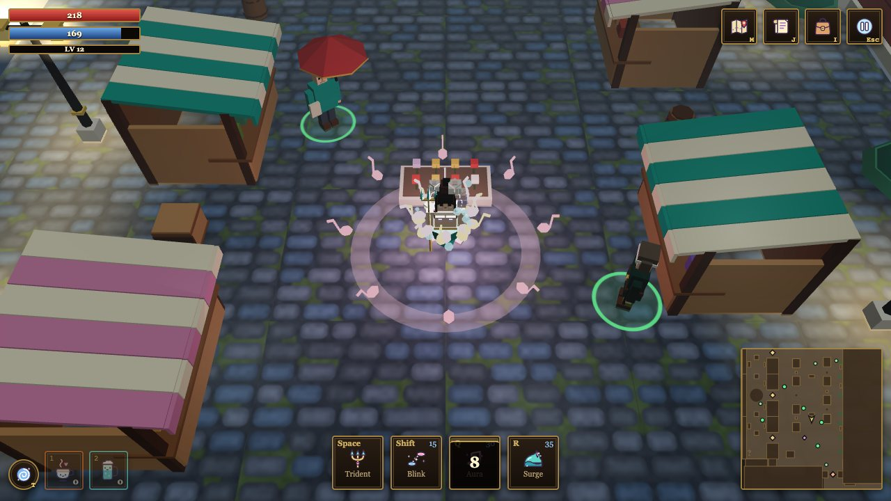
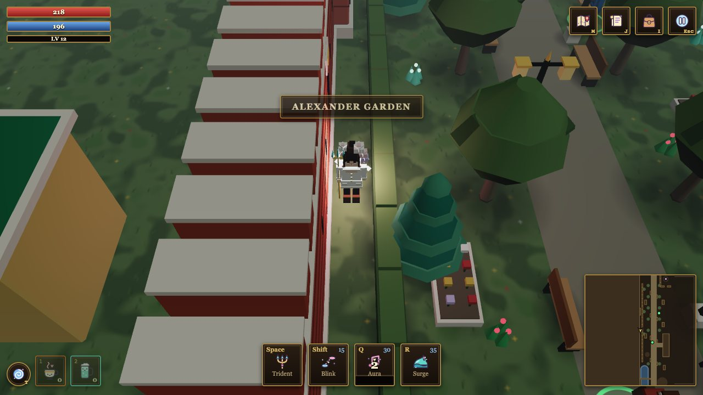
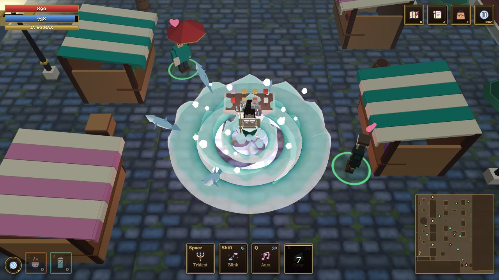
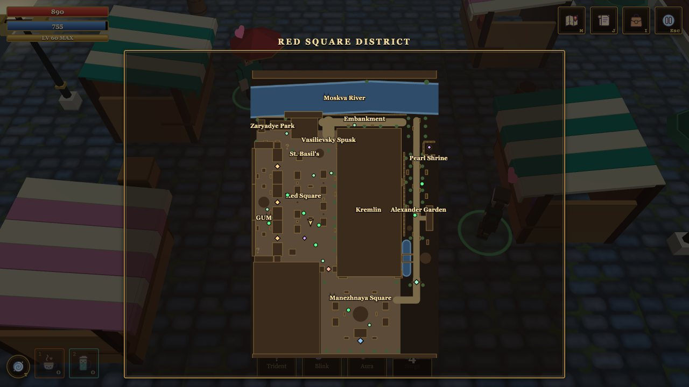
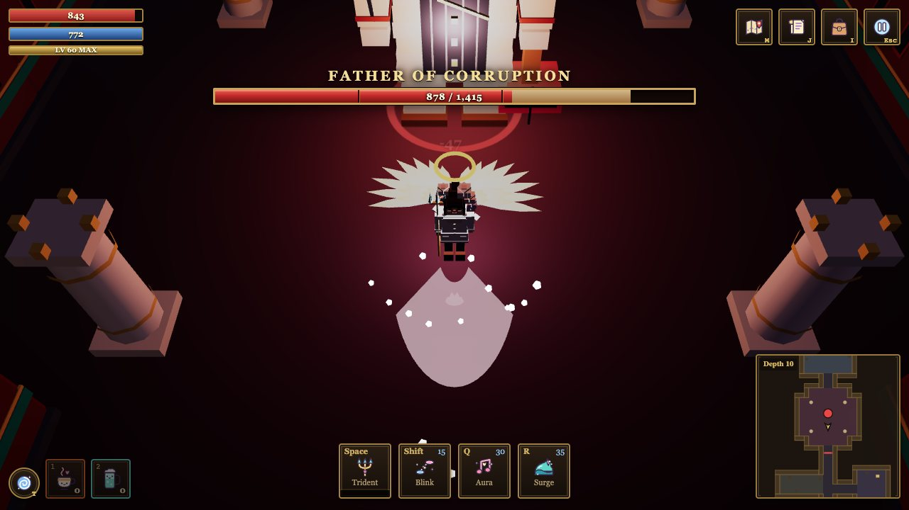
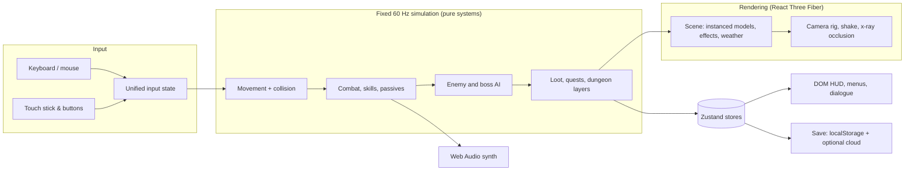

<div align="center">

# 🧜‍♀️ Mermaid Queen of Eurasia

**A small, strange fantasy action-RPG for the browser.**
A rose-crowned mermaid queen arrives in a grey, tired, dreamlike Moscow and decides to build a kingdom there, with a song, a trident, and a great deal of kindness.


</div>

---

## ✨ The game

Central Moscow, on a heavy overcast day. The people are worn down; the politicians have turned into loud, paper-waving monsters. Rosa is a mermaid queen in disguise, and her magic is **music**.

- 🎶 **Sing to win people over.** Her *Aura* is a song: rings of musical notes spread from her, and everyone they touch is charmed, gets a floating heart, and can be talked into joining her growing kingdom.
- 🔱 **Send the gloomy men home.** A trident, a blink, a wave of sea water that can throw sharks. Combat is fast, readable and dodge-based.
- 🌊 **Become a mermaid.** Unlock a second form with a stronger *Tidal Song*, and swim across the river.
- 🕳️ **Go down.** Under the square lies an endless, generated dungeon: **100 layers**, a boss on every tenth, all of it getting meaner the deeper you go.
- 📈 **Grow for sixty levels.** Skills arrive one by one, and every tenth level after that gives one of them a new passive effect. At the very top, Rosa grows holy wings and a halo.

It is deliberately small and silly, and every monster, politician and bureaucrat in it is an **original fictional caricature**: nobody in the game represents a real person.

<div align="center">


<br>
<sub>The Aura song rings out in the market square · a quiet walk in the garden</sub>
</div>

## 🎮 How it plays

| | Keyboard and mouse | Phone |
|---|---|---|
| Move | `W A S D` / arrows, or **left-click** the ground (she finds her own way there) | on-screen stick |
| Trident (three-swing chain) | `Space`, or hold the **right mouse button** to swing where the cursor points | **ATK** |
| Blink (a short teleport) | `Shift` | **BLINK** |
| Aura (a charming song) | `Q` | **AURA** |
| Surge (a wave of sea water) | `R` | **SPELL** |
| Talk / open / pick up | `E`, or click | tap |
| Transform (once unlocked) | `F` | button |
| Recall to Red Square | `T` | button |
| Bag · Quests · Map · Pause | `I` · `J` · `M` · `Esc` | top-right icons |

### Skills that unlock, one by one

| Level | You get |
|---|---|
| 1 | **Trident**: a chain of three swings, a sideways forehand, a wider backhand and a heavy finishing chop |
| 3 | **Aura**: the charming song |
| 6 | **Blink** |
| 10 | **Surge**: a wave of sea water |
| **20** | 🌊 the trident also sends a **sea wave** along the swing, so it becomes a ranged attack |
| **30** | ✨ the Aura throws **rays of light** that sweep around her while she sings |
| **40** | 🦈 Surge lets **small sharks** leap out of the wave and crash down outside it |
| **50** | 🔮 Blink leaves an **arcane blast** where she lands |
| **60** | 👼 **holy wings and a halo** |

<div align="center">

<br><sub>Level 40+: Surge, with sharks jumping out of the wave</sub>
</div>

### The world

- **Red Square and its neighbourhood**, squeezed into a walkable district: the cathedral and its domes, the old department-store arcade, the market stalls, Manezhnaya Square, the leafy Alexander Garden, and further north the slope down to the river embankment, Zaryadye Park, an amphitheatre and a little chapel.
- **People to meet**: eight characters with their own persuasion dialogues (kindness, humor, song or silence, each works differently on each person), seven ordinary locals with a story to tell, and three hidden children to find and rescue.
- **A notice board of 23 quests**, from "sing until the tour guide listens" to clearing the embankment.
- **Weather**: clear spells and drizzle that come and go, with drifting mist.
- **A friend at your side**: recruit a companion who follows you and fights with his own three-swing sword chain.

<div align="center">

</div>

### The dungeon and its bosses

Below the metro pavilion is an **endless-feeling dungeon of 100 generated layers**. The entrance hall and the stairs hall are always in the same place, and everything between them is random rooms, corridors, monsters and chests, generated from the layer number so a layer looks the same every time you visit. Every tenth layer ends in a **boss arena** (five bosses take turns, each with its own moves and phases), and monsters grow tougher with depth, roughly ten times as tough by the bottom.

<div align="center">

<br><sub>Boss fights get a proper health bar, with phase notches and a trail that shows the last hits</sub>
</div>

## 🛠️ Built with

| Concern | Choice |
|---|---|
| Language | **TypeScript** (strict) |
| App / UI | **React 19**: the HUD, menus, dialogue, bag and touch controls are plain DOM |
| 3D | **three.js** through **@react-three/fiber** and **drei** |
| State | **Zustand** stores, plus plain mutable "sim" objects for the hot game loop |
| Build | **Vite** |
| Tests | **Vitest**, 620+ tests over the pure game logic |
| Saves | versioned `localStorage` saves with migrations |
| Cloud (optional) | **Supabase**: anonymous sign-in, cloud save, anonymous stats. The game is fully playable without it |
| 3D assets | generated by **Python scripts in Blender**, optimised with **glTF Transform** |
| Sound | synthesised at runtime with the **Web Audio API**, no sound effect files |

There is **no physics engine, no ECS library and no game framework**: collision, path-finding, combat, AI and the dungeon generator are small, pure, tested TypeScript modules.



## 🚀 Run it

```bash
npm install
npm run dev          # http://localhost:5173
```

| Command | What it does |
|---|---|
| `npm run dev` | dev server with hot reload |
| `npm run build` | type-check and production build |
| `npm run preview` | serve the production build |
| `npm test` | run all tests |
| `npm run typecheck` · `npm run lint` | static checks |
| `npm run assets:optimize` · `npm run assets:check` | shrink 3D assets and check them against the size budgets |

Handy URL parameters: `?welcome=0` skips the title screen, `?perf=1` shows an on-screen performance panel (frame rate, draw calls, memory) with a "copy report" button, `?touch=1` forces the touch controls.

**Cloud save is optional.** Without any configuration the game saves in the browser. To try the cloud save, see [`docs/database-schema.md`](docs/database-schema.md).

## 📚 Read more

| | |
|---|---|
| 🧭 [**Game guide**](docs/game-guide.md) | how to play, in more detail: controls, skills, the world, tips |
| ⚙️ [**How it works**](docs/how-it-works.md) | the technology and the algorithms: game loop, collision, path-finding, combat, boss AI, the dungeon generator, rendering tricks, procedural sound, saves |
| 🎨 [Asset pipeline](docs/asset-pipeline.md) | how the 3D models are made and checked |
| 🧱 [Architecture rules](docs/architecture-rules.md) · [Tech stack](docs/tech-stack.md) · [Code style](docs/code-style.md) | the ground rules for the code |
| 🗒️ [Product brief](Description.md) · [Feature list](docs/features.md) | the pitch and what is in the game |
| 🧪 [Phone QA checklist](docs/qa-iphone.md) | how to test it on a real phone |
| 🗺️ [Roadmap and phase log](docs/Task.md) | how the project was planned and built, phase by phase |

## 🧵 How it was made, in short

The game was built in small, documented **phases** (from "a walking placeholder" to "sixty levels and a boss with a health bar"): each phase started with a short design doc, ended with tests and a check in the browser, and was committed on its own. Everything in the world is **data-driven** (maps, quests, dialogue, items, enemies live in typed data files) and everything that decides an outcome is a **small pure function with tests**, so the game logic can be run, and fought against by a simple test bot, without a browser.

The art is **procedural**: characters, buildings and props are built by scripts as chunky low-poly parts sharing **one 46-colour palette texture**, exported as tiny glTF files (81 models, about 1 MB in all). The sound is **synthesised**: swings, hits, waves, chimes and a generative ambience are described as data and played with oscillators and filtered noise. Even the leaping sharks, the sea waves and the holy wings are geometry generated in code.

## 🌍 A note on the content

This is a work of fantasy and satire. The setting borrows the real look of a famous place; the people, monsters and bosses are **invented archetypes** (a loud tycoon, a paper-stamping registrar, a smiling lobbyist...) and are not meant to resemble any real person. No real politicians, state symbols or party emblems appear, and the jokes are about bureaucracy and corruption, never about a nationality or a group of people.

## 📄 License

MIT, see [`LICENSE`](LICENSE). Asset sources and licences are recorded in [`docs/asset-ledger.md`](docs/asset-ledger.md).
