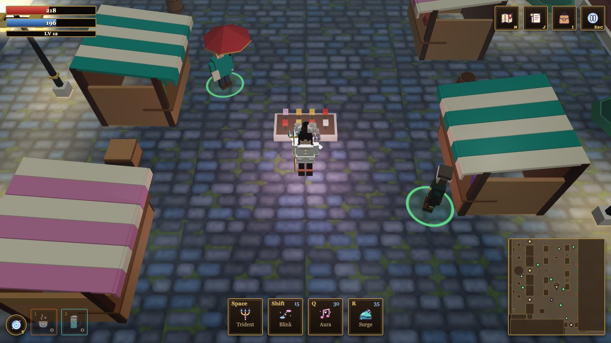

# 🧭 Game guide

*Mermaid Queen of Eurasia* is a small action-RPG about singing a grey city back to life. This guide covers how to play; for how it is built, see [How it works](how-it-works.md).

## The idea in one minute

You are **Rosa**, a mermaid queen in disguise, walking through a moody, dreamlike central Moscow. Ordinary people are gloomy; the corrupt politicians have turned into loud, paper-waving monsters. You have two ways to deal with the world:

1. **Charm it.** Sing the *Aura* song near people, then talk to them. Kindness, humor, song and silence all work, but differently on each person. Win them over and they may join your kingdom (and one may even come along to fight at your side).
2. **Fight it.** Swing the trident at the gloomy men and dodge their swings. Bigger monsters mark the ground before they strike: step out of the red shape and you are fine.

Everything you do gives **experience**. There are **sixty levels**.

## Controls

| Action | Keyboard and mouse | Phone |
|---|---|---|
| Move | `W A S D` or arrow keys; or **left-click** where you want to go and Rosa walks there, going round obstacles | on-screen stick (left thumb) |
| Trident | `Space` (hold to keep swinging), or hold the **right mouse button** to attack toward the cursor | **ATK** |
| Blink | `Shift`: teleport toward the cursor (or the way you are heading) | **BLINK** |
| Aura | `Q` | **AURA** |
| Surge | `R` | **SPELL** |
| Talk, open, pick up | `E`, or click on the person or thing | tap |
| Change form | `F` (after you unlock it) | button |
| Recall | `T`: after a short channel, take Rosa back to Red Square | button |
| Quick potions | `1` and `2` | buttons |
| Bag, Quests, Map, Pause | `I`, `J`, `M`, `Esc` | icons at the top |

Skills you have not unlocked yet are shown dimmed with the level that opens them.

## Skills

| Level | Skill | What it does |
|---|---|---|
| 1 | **Trident** | Your basic attack is a chain of three different swings: a sideways *forehand*, a wider *backhand*, and a slower, heavier *finishing chop* that reaches further. Pause for a moment and the chain starts over. |
| 3 | **Aura** | A song. Rings of notes spread out; people they touch are charmed for a while, and enemies caught in them are *blinded*, stumbling around and swinging at nothing. |
| 6 | **Blink** | A short teleport, even over walls, and a moment of invulnerability. It never takes you into a different, unreachable region. |
| 10 | **Surge** | A wave of sea water that hits everything around you and throws it back, turning Rosa into a mermaid for a moment. |
| 20 | passive: **Sea wave** | Each trident swing also rolls a wave along the swing. The trident is now a ranged weapon too. |
| 30 | passive: **Rays of light** | While the Aura plays, six beams of light sweep round Rosa and hurt what they touch. |
| 40 | passive: **Leaping sharks** | Small sharks jump out of the Surge wave and crash down outside it, each with a small blast. |
| 50 | passive: **Arcane blast** | Blink leaves a violet blast where Rosa lands. |
| 60 | **Holy wings** | Rosa grows wings and a halo. |

**Mana** pays for the skills and refills by itself; **health** refills slowly when you have not been hit for a while. Levelling up heals you fully. Rosa's stats keep growing all the way to level 60.

## The Mermaid form

Finish the right quest and the **mermaid form** is yours: press `F` to switch. In it the Aura becomes the wider, stronger **Tidal Song** (charming longer, blinding longer). Stepping into water changes Rosa into a mermaid by herself, so the river is not a wall any more: you can swim across it.

## Meeting people

Walk up to a character and press `E`. Their **mood** climbs from *gloomy* through *warming* to *mesmerized*, and every conversation offers four kinds of approach:

- **Kindness**, **Humor**, **Song** and **Silence**: different people warm to different approaches, so it pays to try each. The Aura song also charms everyone it reaches for a while.
- A mesmerized person shows a floating **heart**. Charm them enough and they may **join your kingdom**, for a little experience and a story.
- Eight main characters have long persuasion conversations. Seven ordinary locals have a story or a small tip and sometimes a gift. And three **hidden children** are lost somewhere in the district; keep your eyes open, listen to what people say, and follow the hints.

Quests come from the **notice board** in the square (there are 23). A gold **!** floats over the board when there is a new quest to take, and a **?** when one is ready to hand in; the same mark shows on the map. Each quest asks for something different: sing to a tour guide, send a few men home, collect pearls, walk a route, save someone, clear the embankment, make it to a certain depth.

## The world

| Place | What is there |
|---|---|
| **Red Square** | cobbles, market stalls, the cathedral with its domes, lamp posts, the notice board, first fights |
| **The old department-store arcade** | a long glass-roofed gallery with bridges and a fountain (the roof fades so you can see inside) |
| **Manezhnaya Square** | the square by the old riding hall; the metro pavilion with the stairs down |
| **Alexander Garden** | a long garden along the wall: paths, a grotto, hedges, roses, a hidden pearl shrine |
| **Vasilievsky Spusk and the embankment** | the slope down to the river, a promenade with lanterns |
| **Zaryadye Park** | lawns, an amphitheatre and a chapel |
| **The river** | swim across as a mermaid |
| **The dungeon** | 100 layers below the metro |

Things you can pick up: **herbs** that grow back after a while, **pearls** hidden here and there, **loot** that monsters drop, and **chests** in the dungeon. Items go in the **bag** (potions stack in the thousands); gear (a weapon, an outfit, a charm) can be worn for bonuses.

Drizzle comes and goes on the surface; underground it is always dry, always dim, and the drips are the loudest thing.

## The dungeon

Take the metro stairs down.

- Every **layer** has the same **landing** where you arrive and the same **stairs hall** where you leave, both safe. Between them are random rooms and corridors with monsters and chests. A layer is the same every time you visit it, so you can learn one.
- **Every tenth layer** has a **boss**. Five bosses take turns, each with their own arena, moves and phases. When a boss is hurt badly enough he gets angry, and then furious, calls for backup and changes his attacks. His **health bar** appears at the top of the screen with notches where the phases change. When he falls you get a reward, and the stairs down lie beyond his arena.
- **Depth makes everything harder**: monsters have more health and hit harder with every layer, roughly ten times as tough by the bottom, and there are more of them. Levels help; so does dodging.
- The deepest layer you reached is remembered: at the metro pavilion a **Depth** panel lets you jump back to layer 1, to any tenth layer you have reached, or to your deepest, so you do not have to walk it twice.

## Tips

New players get a few **on-screen tips** at the right moments (how to walk, the notice board, a first fight, a new skill...). Each shows once; you can close it, turn tips off, or show them all again in Settings.

- **Read the ground.** Red shapes (circles and long bars) show where a big attack will land, and how soon. Step out, or blink out at the last moment.
- **Aura first.** A blinded enemy hits almost nothing unless you stand right on top of it. Bosses are only blinded for a short time, though.
- **Blink through danger**: the moment of invulnerability covers the whole hop.
- **Drink** when you must, but most fights are won by not being hit.
- **Recall** (`T`) needs a few seconds of standing still and is interrupted by moving, attacking or being hurt.
- If Rosa faints, nothing is lost: get up at the spawn point with most of your health.
- **Settings** (from the pause menu) has sound, volume, ambience, screen shake, weather, damage numbers and a graphics setting. *Auto* graphics lowers quality by itself if the game struggles.

## Saving

The game saves by itself in your browser, and again when you leave the page. Coming back shows a **Welcome back** screen with where you left off. Closing the tab in the middle of a fight does not undo it: monsters, loot and health are kept, and a monster you have beaten stays beaten until its timer runs out. A cloud save is optional and needs a configured server; the game does not need one.
