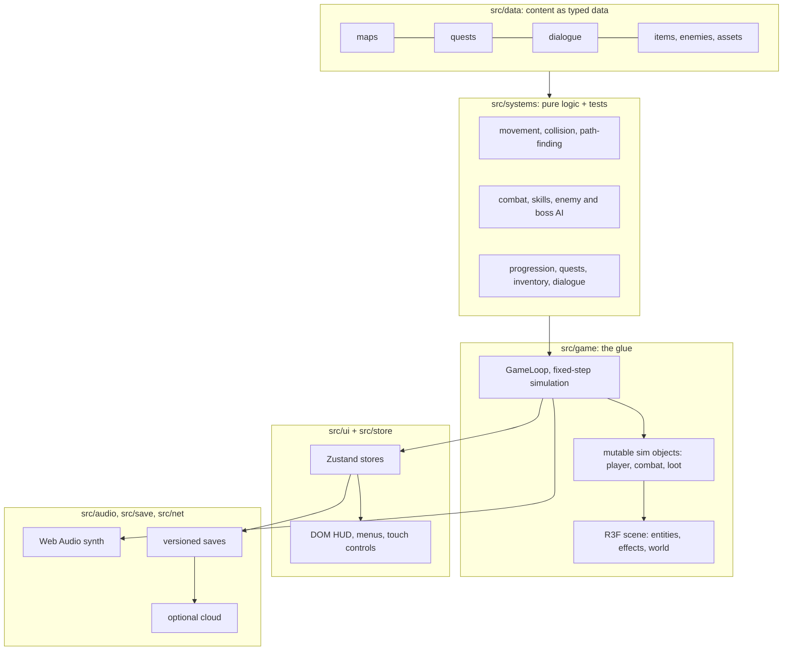

# ⚙️ How it works

A tour of the technology and the algorithms behind *Mermaid Queen of Eurasia*, with pointers into the code. It is a browser game written in strict TypeScript, drawn with three.js through React Three Fiber, and small on purpose: **no physics engine, no ECS library, no game framework.** Everything that decides an outcome is a small pure function with tests.

- [Big picture](#big-picture)
- [The game loop](#the-game-loop)
- [Movement, collision and path-finding](#movement-collision-and-path-finding)
- [Combat and skills](#combat-and-skills)
- [Enemies and bosses](#enemies-and-bosses)
- [The dungeon generator](#the-dungeon-generator)
- [Progression and balance](#progression-and-balance)
- [Dialogue, persuasion and quests](#dialogue-persuasion-and-quests)
- [Rendering](#rendering)
- [Visual effects from code](#visual-effects-from-code)
- [Sound](#sound)
- [The interface](#the-interface)
- [Saving and the cloud](#saving-and-the-cloud)
- [Assets and how they are made](#assets-and-how-they-are-made)
- [Testing and quality](#testing-and-quality)
- [Performance](#performance)
- [How the project was run](#how-the-project-was-run)

---

## Big picture



The rules that keep it easy to change (from [`architecture-rules.md`](architecture-rules.md)):

- **Content is data.** Maps, quests, items, enemies, dialogue and asset lists are typed data files. Adding a quest or a monster is editing a table, not writing logic.
- **Systems are pure.** A system takes a state and some inputs, changes the state (or returns a new one) and reports *events*; it knows nothing about React, three.js or the DOM. That is what makes them testable.
- **The scene only draws.** React Three Fiber components read the simulation state each frame; they never decide anything.
- **One place talks to the network** (`src/net`), and the game never needs it.

Two kinds of state live side by side. **Zustand stores** hold things the UI reacts to (progress, quests, settings, panels). **Mutable "sim" singletons** (the player, the combat state with its enemies and effects, loot on the ground) are updated 60 times a second and read by the renderer; putting them in React state would re-render everything each frame, so they are plain objects.

## The game loop

`src/game/GameLoop.tsx` runs inside R3F's `useFrame`, and drives a **fixed-timestep simulation** (`fixed-step.ts`):

```ts
accumulator += min(frameTime, step * maxSteps)
while (accumulator >= step) { simulate(step); accumulator -= step }
alpha = accumulator / step        // for interpolation
```

The world advances in exact 1/60 s steps however fast the display runs (at most five steps per frame so a stall cannot spiral). Rendering then **interpolates** between the previous and current step with `alpha`, so movement looks smooth on a 120 Hz phone as well as on a slow laptop. A fixed step also makes the simulation **deterministic**, which is what lets the tests play whole boss fights with a simple bot.

The frame also handles input, click-to-move, interaction prompts, the zone name under the player, and pauses drawing entirely (`frameloop="never"`) behind full-screen menus.

## Movement, collision and path-finding

**Collision** (`systems/collision.ts`) is a small custom system: the player is a circle; the world is a list of **boxes, circles and capsules** (rivers are capsules along a path). Moving a circle out of overlaps is a few passes of "push out of the nearest shape". Walls that slide instead of stick fall out of that for free.

**Path-finding** (`systems/pathfinding.ts`) powers click-to-move:

1. The world is turned into a **navigation grid** of 0.5 m cells. A cell is walkable if a player-sized circle can stand there, tested by an allocation-free "free test" that only looks at the colliders in a **bucket grid** (4 m buckets), and cached; the cache is filled in time slices at start-up so the first click never stalls.
2. **A\*** over the 8-connected grid with the *octile distance* heuristic and a binary **min-heap**; diagonal steps are refused if they would cut a corner.
3. The cell path is **smoothed** with line-of-sight checks (string pulling) so Rosa walks in straight lines, not staircases.
4. `sameRegion` (a flood fill) tells whether two points are connected at all, which stops **Blink** from teleporting Rosa into a sealed-off area.

**Blink** (`systems/blink.ts`) picks its destination by walking along the aimed line to the furthest free spot within range that is still in the same region.

## Combat and skills

`systems/combat.ts` steps the whole fight once per tick and returns a list of **events** (`enemyHit`, `enemyDefeated`, `playerHurt`, `cast`, `passive`, `bossPhase`...). Sound, damage numbers, screen shake, quests and XP subscribe to the events; the combat code knows about none of them.

- **Hit tests** are geometric: a *cone* (range and half-angle) for melee, a *circle* for waves, a point-to-segment distance for Aura light beams. `combat-math.ts` holds them.
- **Aim assist** nudges the swing toward a nearby enemy (with the mouse, the exact cursor direction is used instead).
- **The three-swing chain**: a small table (`TRIDENT_COMBO`) of range, angle, damage, knockback and cooldown per swing; a timer resets the chain when you stop.
- **Skills unlock by level** and **passives switch on at set levels** (`systems/skills.ts`); the combat step just asks `isUnlocked` and `hasPassive`.
- **Passive effects are small state machines** in the combat state: sea waves are projectiles that hit each enemy once, sharks fly a fixed-duration arc and blast where they land, beams are rays whose angle is a function of the song's clock.
- **Blinded enemies** stumble in random directions and only hit at point-blank range: the Aura is a crowd-control spell.

## Enemies and bosses

**Ordinary enemies** (`systems/enemy-ai.ts`) are small state machines: `idle → chase → windup → attack → recover`, plus `stunned`, `blinded`, `returning` (they give up beyond a *leash* distance and walk home, healing) and `dead` (they respawn after a while on the surface, never underground). The windup is a visible tell.

**Bosses** (`systems/boss.ts`) are data-driven scripts:

- Each boss has a table of **moves per phase** (stomp, stamp, darts, summon, storm, form, rain, charge...). Phases change at 60% and 30% of his health; the last is faster.
- Attacks are **telegraphed hazards** (`systems/hazards.ts`): a circle or an oriented rectangle appears on the ground, and lands after a delay. The player is hit only if her circle overlaps the shape at that moment, tested with an exact circle-vs-oriented-rectangle check. Fair, and readable.
- He only fights while Rosa is inside the arena; if she leaves or faints he walks home and heals, and forgets the fight.
- Tests include a **boss-fight bot** (a plain "walk up, stab, step out of markers, blink at the last moment" player) used to keep the balance honest: it must be able to win at the intended level and must lose when far below it.

## The dungeon generator

The underground is **100 generated layers** (`data/maps/underground.ts`), and it is a good example of *procedural, but reproducible*:

- **Seeded randomness.** Each layer number derives a seed for `mulberry32`, a tiny fast pseudo-random generator, so **layer *n* is identical every time**. The save only has to store "layer 37", never the map.
- **Fixed ends, random middle.** A 26×47 grid of 2 m cells. The entrance hall (south) and the stairs hall (north) are stamped identically on every layer; between them the generator places 3-7 random rooms (fewer on boss layers), joins them with 2 m corridors along a path from landing to stairs plus the odd loop, then runs a **topology pass** that closes one-cell gaps and checkerboard corners so walls look right.
- **Validate, or throw it away.** Every roll is checked with the *game's own navigation grid*: the stairs and every monster and chest must be reachable from the landing. If a column or a stack of paper blocks the way, the attempt is discarded and rolled again with the next sub-seed. A layer takes 8-30 ms to make.
- **Depth scaling.** `power(n) = 1 + 0.06(n−1) + 0.0004(n−1)²`: health scales with it, damage with 42% of the extra, XP with a third. More monsters and more elite ones appear deeper.
- **Boss layers.** Every tenth layer swaps some rooms for an arena with a gate that opens when the layer's monsters are down.
- **Runtime.** Entering a layer generates it, installs its walls and monsters into the shared collision and combat state, and swaps the scene, minimap and map. Leaving removes them again.

## Progression and balance

- **XP curve**: 40, 70, 100... for the first nine levels, then `280 + 70 × (level − 9)`. Sixty levels in all.
- **Stats** grow linearly (health, mana, damage multiplier), a little faster after level 10.
- **Balance by measurement.** Rather than guess, the tests fix a few points of the curve with the boss bot: e.g. it needs about level 10 for the first boss, 22 for layer 50 and the high forties for the last layers, in starter gear. A change that makes the game too easy or too hard shows up as a failing test.

## Dialogue, persuasion and quests

- **Dialogue trees** are data: nodes that are lines, menus of choices, or invisible *routers* that pick the next node from *conditions* (mood above or below a value, a method already used, joined, following, a child saved); choices and nodes carry *effects* (change mood, mark a method used, join, follow, save a child, give a small gift). `systems/dialogue.ts` is a small interpreter over that data.
- **Persuasion** (`data/persuasion.ts`) builds a full conversation tree for each character from a handful of per-character lines, using four methods: kindness, humor, song, silence. Each person's mood (`systems/relationship.ts`) moves through tiers: *gloomy → warming → mesmerized*, then optionally *joined*.
- **Quests** (`systems/quests.ts`) are objectives (`kill`, `visit`, `collect`, `mesmerize`, `recruit`, `level`, `save`, dungeon flags) with counters and rewards. Game events feed them; the quest system does not poll the world.

## Rendering

The look is **low-poly, chunky and moody**, and it is cheap on purpose so that it runs on a phone.

- **One palette, one texture, one material.** Every model uses a shared 46-colour palette baked into a 128×128 atlas; each face's UVs point at the centre of a colour cell. All models share one `MeshLambertMaterial` with nearest-neighbour filtering. Large ground surfaces (cobbles, grass) use small tiling detail textures generated by a script.
- **Instancing.** Repeated things (trees, stalls, lamp posts, walls) are drawn with `InstancedMesh`, one draw call per model type. The **draw-call budget is 70** for any scene and is measured with a debug overlay.
- **Merged geometry.** Flat coloured floors, ribbons (rivers, paths) and chests are merged into a single mesh with per-vertex colours.
- **Fog and cheap lighting.** A hemisphere light, a directional light, exponential fog and a few point lights that only exist near the player; ground lamp glow is a handful of additive planes.
- **A top-down camera at a fixed angle** (about 54° elevation) that follows the player with smoothing and shakes on impacts (a decaying "trauma" value, squared, drives the shake).
- **Seeing through buildings.** When a tall model stands between the camera and Rosa (a segment-vs-box test using the *slab method*), it fades to a stipple; and a **stencil-buffer x-ray** draws a pink silhouette of her where she is hidden.
- **Adaptive quality.** A performance monitor lowers the pixel ratio and glow count when the frame rate drops (the *Auto* graphics setting), and the canvas stops rendering completely behind menus.
- **Chunky characters.** People are *rigid-part node hierarchies* (torso, head, arms, legs, a tail chain) with hand-authored idle and walk clips, not skinned meshes: tiny files and no skeleton budget. Weapon swings are then driven **procedurally** in code from keyframed poses.

## Visual effects from code

There are almost no effect textures. Most of what you see is generated:

- **Sea waves and Surge**: a ring of "breaking wave" geometry built from a cross-section profile (deep water, mid, foam) revolved around a circle with a wobble that makes the crest roll; a curved crest for the trident's wave; swirling foam arms; ballistic droplets.
- **Sharks**: a merged low-poly shark, one draw call, flown on a parabola with pitch following the derivative of the arc.
- **Additive layers** (light beams, the violet sigil, splash rings): tapered or ring-shaped geometry drawn additively, so dark simply means transparent and fading is "multiply the colour toward black".
- **Hand-refilled instanced layers**: each effect family is one `InstancedMesh` rewritten every frame, so a fight with dozens of droplets and rays is still a handful of draw calls.
- **Wings and halo**: leaf-shaped feathers fanned in three rows per wing plus a torus ring, merged into a single mesh.
- **Weather** (`systems/weather.ts`) is a tiny state machine: clear and rainy spells with random durations and a slow fade; rain is one draw call of line segments recycled around the player, mist is a set of drifting soft points.

## Sound

There are **no sound effect files.** Everything is synthesised with the Web Audio API (`src/audio`):

- **Sounds are data.** A sound is a few *tones* (oscillator, frequency glide, envelope) plus filtered *noise bursts*, described in a table and played by one generic function. Tests keep every sound short, quiet and inside a sensible range.
- **Soft noise.** The shared noise buffer is white noise through a gentle one-pole low-pass, so hits and waves have body instead of hiss.
- **A master bus** with a squared volume curve, so the slider feels natural.
- **Generative ambience**: wind and a soft pad with the occasional distant bell from a pentatonic scale on the surface; a low drone and random drips underground; a slow pulse in a boss arena. Scenes cross-fade.
- The Aura song is the one recorded sample, kept quiet.
- Browsers refuse to play audio before a user gesture, so the audio context is created and resumed on the first tap or key.

## The interface

- **The HUD is plain DOM** (React), which keeps text crisp on phones and is easy to lay out for both portrait and landscape.
- **No re-renders per frame.** Bars, cooldown sweeps, the boss health bar and the floating damage numbers are updated by a single shared `requestAnimationFrame` ticker that writes styles and text directly; React only re-renders when something structural changes. The damage numbers are a pool of 24 reusable elements.
- **Touch controls** use pointer events with an explicit *pointer tracker* per control, so a lost `pointerup` (a call, a gesture, an overlay opening) can never leave the stick stuck. A watchdog resets input if the stick is non-zero with no fingers on the screen.
- **Mouse and touch behave alike**: click-to-move and the right-button attack use the cursor's position projected onto the ground plane with a raycaster.
- **Responsive**: safe-area insets for notches, menus that rearrange for a phone held sideways, and touch targets of at least 44 px.

## Saving and the cloud

- **Saves are versioned** (`src/save`). Each shape change bumps the version and adds a **migration** from the previous one, so old saves keep loading. Loading is **defensive**: every field is validated and clamped, unknown ids are dropped, and a hand-edited or corrupt save cannot crash the game or grant impossible values.
- **The world is saved too**: monsters and their health, loot on the ground, herbs that are regrowing, the boss's phase. Timers count *play time*, so closing the tab cannot be used to skip a wait. That snapshot stays on the device.
- **Autosave** runs on a timer, when the tab is hidden, and on important events.
- **Cloud (optional)**: anonymous sign-in, a per-device save row, and an **offline-first event queue** for anonymous stats with batching, exponential backoff and a persisted queue. Nothing in the game waits on the network, and with no configuration it is simply off.

## Assets and how they are made

Characters, buildings and props are **built by Python scripts in Blender** (`tools/blender`), not sculpted by hand:

1. A small builder library provides `Part` (a group of boxes, cones and prisms, each face assigned a palette colour), beveling, smooth-shaded domes, and an *audit* that checks windows and doors sit on their walls, nothing floats or pokes through, and no plate is too thin.
2. A script builds each model, authors its animation clips as keyframes on the parts, and exports a glTF file.
3. `npm run assets:optimize` runs **glTF Transform** (dedupe, weld, meshopt compression, quantisation).
4. `npm run assets:check` enforces **budgets** (triangles, kilobytes, texture size per category) and checks that every model is in the manifest and licence ledger. It also runs in the test suite.

The result: 81 models in about a megabyte. Scripts are the source of truth and every asset can be rebuilt.

## Testing and quality

- **600+ tests** with Vitest, mostly on the pure systems: collision, path-finding (including "is the path always walkable?"), combat (each skill and each passive), enemy and boss AI, the dungeon generator (across many layers: connectivity, fixed halls, boss gates), progression, quests, inventory, dialogue, save parsing and migrations, the sync queue, audio recipes, weather, and even the swing poses.
- **Invariants over examples.** Generated content is tested with properties ("every one of 100 layers is connected", "no monster stands in a safe hall") rather than single hand-picked cases.
- **Strict TypeScript**, ESLint (including the React compiler rules, which catch mutation-in-render mistakes) and Prettier.
- **Browser checks** with a headless Chromium driven by scripts: teleport to a place, fire a skill, take a screenshot, read the draw-call counter; also mobile emulation for layout audits (touch target sizes, overlaps, off-screen controls) and a soak run that watches memory.

## Performance

Targets are a steady 60 fps on desktop and a smooth game on a phone:

- ≤ 70 draw calls per scene, about 120 thousand triangles in the busiest one.
- One shared texture; instancing; merged static geometry; effects that cost nothing when idle (an empty instanced layer is not drawn).
- Adaptive pixel ratio; no rendering behind menus; nav-grid work sliced over frames.
- Hand-built GPU resources are freed when their owner goes away (a soak test caught a small geometry leak in the layer changes).
- Add `?perf=1` to the address for an on-screen panel (frame rate, worst frames, draw calls, memory) with a button that copies a report.

## How the project was run

The game was built in **phases**, each small enough to finish and check:

1. Write the phase's design doc: goal, scope, steps, "definition of done".
2. Implement, with tests for any new logic.
3. Check in the browser at desktop and phone sizes; check console, budgets and offline behaviour.
4. Commit the phase on its own, then record it in the roadmap.

The phase log in [`docs/Task.md`](Task.md) reads like a diary of the game: a walking placeholder, the first assets, the district and its people, combat and bosses, the second form and swimming, an endless dungeon, weather and sound, and finally sixty levels and a phone pass.
